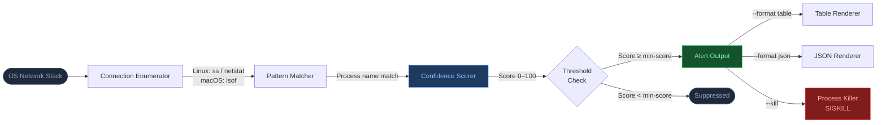
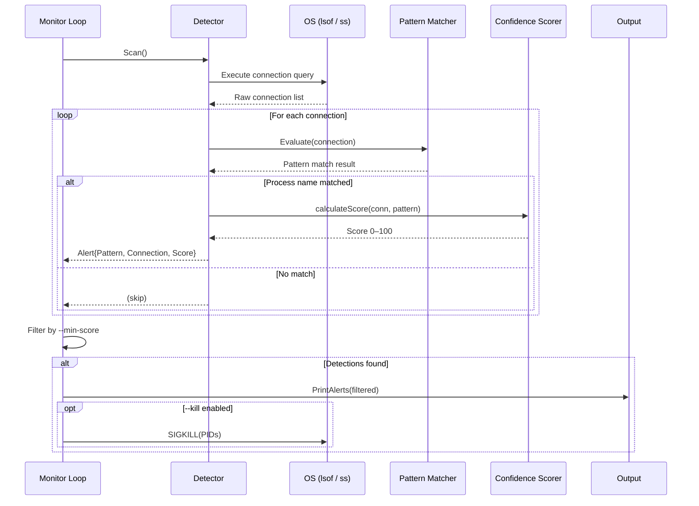
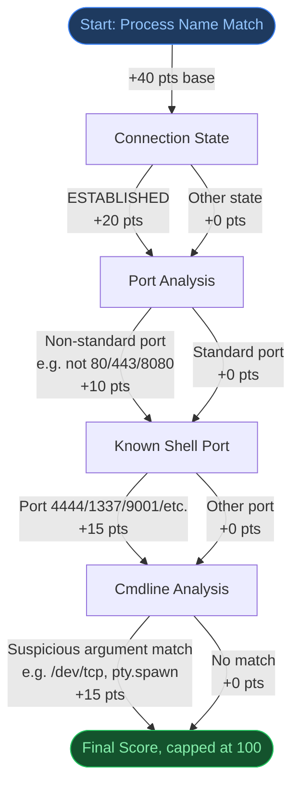

<p align="center">
  
</p>

<p align="center">
  <a href="https://go.dev"></a>
  <a href="LICENSE"></a>
  <a href="#"></a>
  <a href="#"></a>
  <a href="#"></a>
  <a href="#"></a>
</p>

<h3 align="center">Real-Time Reverse Shell Detection Engine</h3>
<p align="center"><em>Built for SOC analysts, incident responders, and system administrators</em></p>

---

> [!NOTE]
> **shell-Ender** is a **blue team defensive tool** that continuously monitors active network connections and correlates them with known reverse shell process patterns to detect active compromise in real time. It is a single static binary with zero runtime dependencies — deploy it anywhere in seconds.

## Table of Contents

- [Features](#features)
- [Architecture](#architecture)
- [Detection Pipeline](#detection-pipeline)
- [Quick Start](#quick-start)
- [Usage](#usage)
- [Detection Patterns](#detection-patterns)
- [Confidence Scoring](#confidence-scoring)
- [Integrations](#integrations)
- [Project Structure](#project-structure)
- [Credits](#credits)
- [License](#license)

---

## Features

| Capability | Detail |
|---|---|
| **20+ Detection Patterns** | Bash, Python, Perl, Ruby, PHP, Node.js, Netcat, Socat, Lua, Awk, OpenSSL, Meterpreter, PowerShell, Xterm, and more |
| **Real-Time Monitoring** | Goroutine-based concurrent scanning with configurable intervals (default: 5s) |
| **Confidence Scoring** | Every alert is scored 0–100 based on process name, connection state, port analysis, and command-line pattern matching |
| **Cross-Platform** | Native support for Linux (`ss` / `netstat`) and macOS (`lsof`) |
| **Auto-Kill Mode** | Optionally terminate detected reverse shell processes automatically via SIGKILL |
| **Dual Output Formats** | Human-readable table or machine-parseable JSON for SIEM integration |
| **Graceful Shutdown** | Signal handling (SIGINT / SIGTERM) with a full session summary on exit |
| **Structured Logging** | Leveled logging (debug, info, warn, error) via Go's `log/slog` |
| **Zero Dependencies** | Pure Go standard library — no third-party packages |
| **Static Binary** | Single binary deployment, no runtime dependencies or container required |
| **Native OS Integration** | Uses `ss`/`netstat` on Linux and `lsof`/`ps` on macOS for connection and process visibility |

---

## Architecture

The detection engine is composed of four cooperating subsystems that flow from raw OS data to actionable alerts:



### Component Breakdown

| Component | File | Responsibility |
|---|---|---|
| **CLI & Signal Handling** | `cmd/root.go` | Flag parsing, banner, SIGINT/SIGTERM handler, logger setup |
| **Monitor Loop** | `internal/monitor/monitor.go` | Goroutine orchestration, scan scheduling, session summary |
| **Detection Engine** | `internal/detector/detector.go` | Connection enumeration, pattern matching, confidence scoring |
| **Pattern Registry** | `internal/detector/patterns.go` | Declarative definitions for all 20+ detection patterns |
| **Process Termination** | `internal/monitor/kill.go` | Safe SIGKILL dispatch with PID sanity checks |
| **Output Formatter** | `internal/output/formatter.go` | Table (tabwriter) and JSON (encoding/json) rendering |

---

## Detection Pipeline

The following diagram shows exactly what happens during a single scan cycle:



---

## Quick Start

### Build from Source

```bash
git clone https://github.com/jennofrie/shell-Ender.git
cd shell-Ender
go build -o shell-Ender .
```

> Requires Go 1.26+. No external dependencies — `go build` is all you need.

### Runtime Requirements

| Platform | Tools Used |
|---|---|
| Linux | `ss` (preferred), `netstat` (fallback) |
| macOS | `lsof`, `ps` |

Root or `sudo` is recommended for full process and connection visibility.

### Run a Scan

```bash
# One-time scan (root required for full process visibility)
sudo ./shell-Ender scan

# Continuous monitoring — runs until Ctrl+C
sudo ./shell-Ender scan --watch

# JSON output for SIEM ingestion
sudo ./shell-Ender scan --format json --watch

# Auto-terminate detected shells
sudo ./shell-Ender scan --kill --watch

# Only surface high-confidence alerts (score >= 60)
sudo ./shell-Ender scan --min-score 60 --watch

# Debug mode with verbose output
sudo ./shell-Ender scan --watch --verbose --log-level debug
```

### List Detection Patterns

```bash
./shell-Ender patterns
./shell-Ender patterns --format json
```

---

## Usage

```
USAGE:
  shell-Ender <command> [flags]

COMMANDS:
  scan        Scan for reverse shell connections
  patterns    List all detection patterns
  version     Print version information
  help        Show this help message

SCAN FLAGS:
  --watch            Run continuously (Ctrl+C to stop)
  --interval 5s      Scan interval for continuous mode (default: 5s)
  --format table     Output format: table, json (default: table)
  --min-score 0      Minimum confidence score to report (default: 0)
  --kill             Automatically terminate detected processes
  --verbose          Show info messages even for clean scans
  --log-level info   Log level: debug, info, warn, error (default: info)
```

> [!WARNING]
> The `scan` command requires root / sudo on Linux and macOS for full process and connection visibility. Running without root may yield incomplete results.

---

## Detection Patterns

shell-Ender ships with 20+ patterns covering every major reverse shell technique in common offensive toolkits:

| Pattern | Category | Severity | Process Names |
|---|---|---|---|
| Bash Reverse Shell | shell | **CRITICAL** | `bash` |
| Zsh Reverse Shell | shell | **CRITICAL** | `zsh` |
| Sh / Dash Reverse Shell | shell | **CRITICAL** | `sh`, `dash` |
| Python Reverse Shell | scripting | **CRITICAL** | `python`, `python2`, `python3`, `python3.x` |
| Perl Reverse Shell | scripting | **CRITICAL** | `perl`, `perl5` |
| Ruby Reverse Shell | scripting | **HIGH** | `ruby`, `irb` |
| PHP Reverse Shell | scripting | **CRITICAL** | `php`, `php-fpm`, `php-cgi` |
| Node.js Reverse Shell | scripting | **HIGH** | `node`, `nodejs` |
| Lua Reverse Shell | scripting | **HIGH** | `lua`, `luajit`, `lua5.x` |
| Awk Reverse Shell | scripting | **HIGH** | `awk`, `gawk`, `mawk`, `nawk` |
| Netcat Reverse Shell | networking | **CRITICAL** | `nc`, `ncat`, `netcat` |
| Socat Reverse Shell | networking | **CRITICAL** | `socat` |
| Telnet Reverse Shell | networking | **HIGH** | `telnet` |
| OpenSSL Reverse Shell | networking | **CRITICAL** | `openssl` |
| Meterpreter / Msfvenom Payload | implant | **CRITICAL** | `meterpreter`, `msfconsole`, `msfvenom` |
| PowerShell Reverse Shell | shell | **CRITICAL** | `pwsh`, `powershell` |
| Xterm Reverse Shell | shell | **HIGH** | `xterm` |

### Adding Custom Patterns

Edit `internal/detector/patterns.go` and append a new `Pattern` struct to the `DefaultPatterns()` slice:

```go
{
    Name:         "Custom Tool",
    Category:     "networking",         // shell | scripting | networking | implant
    Severity:     "critical",           // critical | high | medium | low
    ProcessNames: []string{"mytool"},
    Description:  "Custom tool with suspicious network activity",
    CmdPatterns:  []string{"-e /bin/sh", "reverse"},
},
```

---

## Confidence Scoring

Every detection produces a confidence score (0–100) derived from multiple independent signals:



| Factor | Points | Trigger Condition |
|---|---|---|
| Process name match | +40 | Process name is in a known reverse shell pattern's process list |
| ESTABLISHED state | +20 | Connection is actively established (not just listening) |
| Non-standard port | +10 | Remote port is not 80, 443, 8080, or 8443 |
| Known shell port | +15 | Remote port matches common C2 ports (4444, 4445, 5555, 1337, 9001, 9002) |
| Command-line match | +15 | Process arguments contain a suspicious pattern (e.g., `/dev/tcp`, `pty.spawn`, `IO::Socket`) |

Use `--min-score` to tune sensitivity:
- `--min-score 0` — report everything (highest sensitivity, may include false positives)
- `--min-score 55` — established connections on non-standard ports
- `--min-score 70` — high-confidence detections with cmdline evidence
- `--min-score 85` — near-certain detections on known C2 ports with matching arguments

---

## Integrations

### SIEM / Log Aggregation

Pipe JSON output directly into your SIEM or log aggregator:

```bash
# Stream to a local log file
sudo ./shell-Ender scan --format json --watch 2>/dev/null | jq . >> /var/log/shell-ender.json

# Pipe to Elasticsearch via curl
sudo ./shell-Ender scan --format json --watch 2>/dev/null \
  | while IFS= read -r line; do
      curl -s -X POST "http://localhost:9200/shell-ender/_doc" \
           -H 'Content-Type: application/json' -d "$line"
    done
```

### Systemd Service (Linux)

Deploy shell-Ender as a persistent system service:

```ini
[Unit]
Description=shell-Ender Reverse Shell Detection Engine
Documentation=https://github.com/jennofrie/shell-Ender
After=network.target

[Service]
Type=simple
ExecStart=/usr/local/bin/shell-Ender scan --watch --format json --log-level warn
Restart=always
RestartSec=5
StandardOutput=append:/var/log/shell-ender.json
StandardError=journal

[Install]
WantedBy=multi-user.target
```

```bash
sudo cp shell-Ender /usr/local/bin/
sudo systemctl daemon-reload
sudo systemctl enable --now shell-ender
sudo journalctl -u shell-ender -f
```

### Cron (Periodic Scan)

```bash
# Scan every 5 minutes, append JSON alerts to log
*/5 * * * * /usr/local/bin/shell-Ender scan --format json >> /var/log/shell-ender.json 2>&1
```

---

## Project Structure

```
shell-Ender/
├── main.go                          # Entry point — delegates to cmd.Execute()
├── go.mod                           # Module: github.com/jennofrie/shell-Ender
├── cmd/
│   └── root.go                      # CLI parsing, flag definitions, signal handling, banner
├── internal/
│   ├── detector/
│   │   ├── detector.go              # Core engine: connection enumeration, pattern evaluation, scoring
│   │   └── patterns.go              # Declarative registry of all 20+ detection patterns
│   ├── monitor/
│   │   ├── monitor.go               # Scan loop orchestration, goroutine management, session summary
│   │   └── kill.go                  # SIGKILL dispatch with PID sanity checks
│   └── output/
│       └── formatter.go             # Table (tabwriter) and JSON output rendering
└── assets/
    └── banner.svg                   # Project banner
```

---

## Credits

**shell-Ender** is developed and maintained by **[JD Digital Systems](https://github.com/jennofrie)**.

---

## License

[MIT](LICENSE) — Copyright JD Digital Systems
